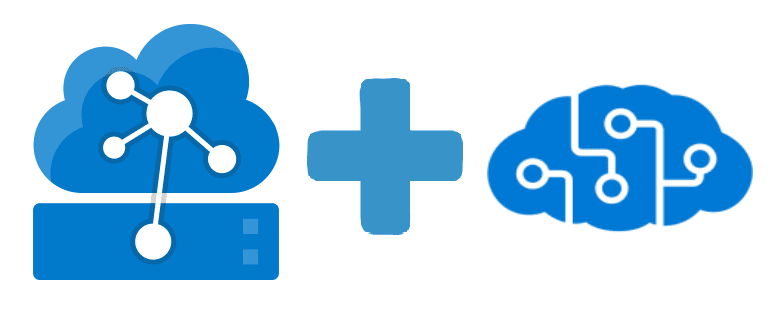

[![Contributors][contributors-shield]][contributors-url]
[![Forks][forks-shield]][forks-url]
[![Stargazers][stars-shield]][stars-url]
[![Issues][issues-shield]][issues-url]
[![MIT License][license-shield]][license-url]

<!-- PROJECT LOGO -->
 

  

<h3 align="center">Anomaly Detection in Acoustics using IoT Edge</h3>

  

    Steps to do Anomaly Detection in Acoustics using IoT Edge in Azure Percept
     
    <a href="https://github.com/wislam01/acoustic-anomaly-iotedge"><strong>Explore the docs »</strong></a>
     
     
    <a href="https://github.com/wislam01/acoustic-anomaly-iotedge">View Demo</a>
    ·
    <a href="https://github.com/wislam01/acoustic-anomaly-iotedge/issues">Report Bug</a>
    ·
    <a href="https://github.com/wislam01/acoustic-anomaly-iotedge/issues">Request Feature</a>
  

<!-- TABLE OF CONTENTS -->

  
Table of Contents

  <ol>
    <li>
      <a href="#about-the-project">About The Project</a>
      <ul>
        <li><a href="#Languages and Tools">Built With</a></li>
      </ul>
    </li>
    <li>
      <a href="#getting-started">Getting Started</a>
      <ul>
        <li><a href="#prerequisites">Prerequisites</a></li>
        <li><a href="#installation">Installation</a></li>
      </ul>
    </li>
    <li><a href="#usage">Usage</a></li>
    <li><a href="#contributing">Contributing</a></li>
    <li><a href="#license">License</a></li>
    <li><a href="#contact">Contact</a></li>
    <li><a href="#acknowledgments">Acknowledgments</a></li>
  </ol>

<!-- ABOUT THE PROJECT -->
## About The Project

This project is to create a solution to acquire acoustic .wav files, convert them into spectrograms, and then use a Machine Learning model to detect anomalies using an Azure Percept device. This project builds on the work in the repo(s) below.

* [Acoustic Predictive Maintenance with Azure Percept](https://github.com/christian-vorhemus/azure-percept-iot-edge)

(<a href="#top">back to top</a>)

### Languages and Tools

  

(<a href="#top">back to top</a>)

<!-- GETTING STARTED -->
## Getting Started

These will be the steps to set up and Azure Percept device to acquire .wav file for using them in a machine learning model. 

### Prerequisites

Will need to first provision the Azure Percept device using the guide linked below. 
1. [Set up the Azure Percept DK device | Microsoft Docs](https://docs.microsoft.com/en-us/azure/azure-percept/quickstart-percept-dk-set-up)

### Installation

Placeholder

(<a href="#top">back to top</a>)

<!-- USAGE EXAMPLES -->
## Usage

Placeholder

(<a href="#top">back to top</a>)

<!-- CONTRIBUTING -->
## Contributing

Contributions are what make the open source community such an amazing place to learn, inspire, and create. Any contributions you make are **greatly appreciated**.

If you have a suggestion that would make this better, please fork the repo and create a pull request. You can also simply open an issue with the tag "enhancement".
Don't forget to give the project a star! Thanks again!

1. Fork the Project
2. Create your Feature Branch (`git checkout -b feature/AmazingFeature`)
3. Commit your Changes (`git commit -m 'Add some AmazingFeature'`)
4. Push to the Branch (`git push origin feature/AmazingFeature`)
5. Open a Pull Request

(<a href="#top">back to top</a>)

<!-- LICENSE -->
## License

Distributed under the MIT License. See `LICENSE.txt` for more information.

(<a href="#top">back to top</a>)

<!-- CONTACT -->
## Contact

Wiston Lamshing - [![LinkedIn][linkedin-shield]][linkedin-wiston-url]

Terry Mandin - [![LinkedIn][linkedin-shield]][linkedin-terry-url]

Project Link: [https://github.com/wislam01/acoustic-anomaly-iotedge](https://github.com/wislam01/acoustic-anomaly-iotedge)

(<a href="#top">back to top</a>)

<!-- ACKNOWLEDGMENTS -->
## Acknowledgments

* [Acoustic Predictive Maintenance with Azure Percept](https://github.com/christian-vorhemus/azure-percept-iot-edge)

(<a href="#top">back to top</a>)

<!-- MARKDOWN LINKS & IMAGES -->
<!-- https://www.markdownguide.org/basic-syntax/#reference-style-links -->
[contributors-shield]: https://img.shields.io/github/contributors/wislam01/acoustic-anomaly-iotedge.svg?style=for-the-badge
[contributors-url]: https://github.com/wislam01/acoustic-anomaly-iotedge/graphs/contributors
[forks-shield]: https://img.shields.io/github/forks/wislam01/acoustic-anomaly-iotedge.svg?style=for-the-badge
[forks-url]: https://github.com/wislam01/acoustic-anomaly-iotedge/network/members
[stars-shield]: https://img.shields.io/github/stars/wislam01/acoustic-anomaly-iotedge.svg?style=for-the-badge
[stars-url]: https://github.com/wislam01/acoustic-anomaly-iotedge/stargazers
[issues-shield]: https://img.shields.io/github/issues/wislam01/acoustic-anomaly-iotedge.svg?style=for-the-badge
[issues-url]: https://github.com/wislam01/acoustic-anomaly-iotedge/issues
[license-shield]: https://img.shields.io/github/license/wislam01/acoustic-anomaly-iotedge.svg?style=for-the-badge
[license-url]: https://github.com/wislam01/acoustic-anomaly-iotedge/blob/main/LICENSE.txt
[linkedin-shield]: https://img.shields.io/badge/-LinkedIn-black.svg?style=for-the-badge&logo=linkedin&colorB=555
[linkedin-wiston-url]: https://linkedin.com/in/wiston-lamshing
[linkedin-terry-url]: https://linkedin.com/in/terry-mandin
[product-screenshot]: images/screenshot.png
[Python-url]: https://www.python.org
